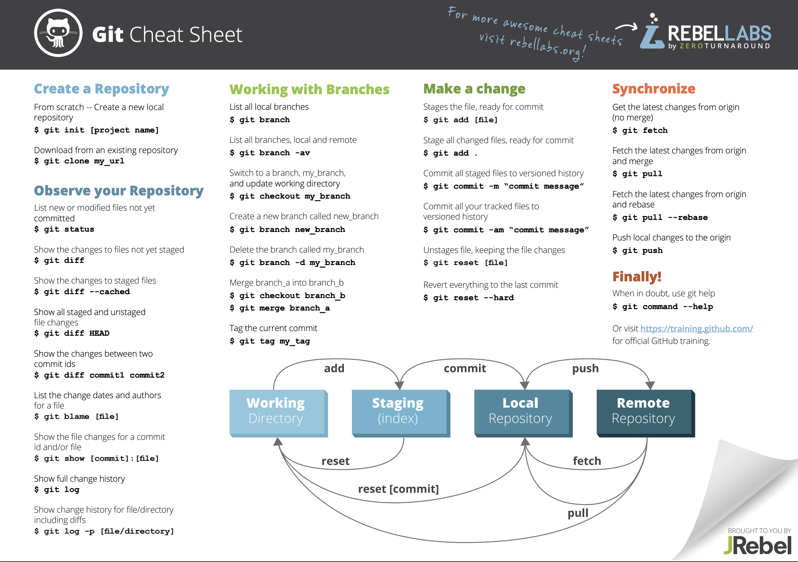
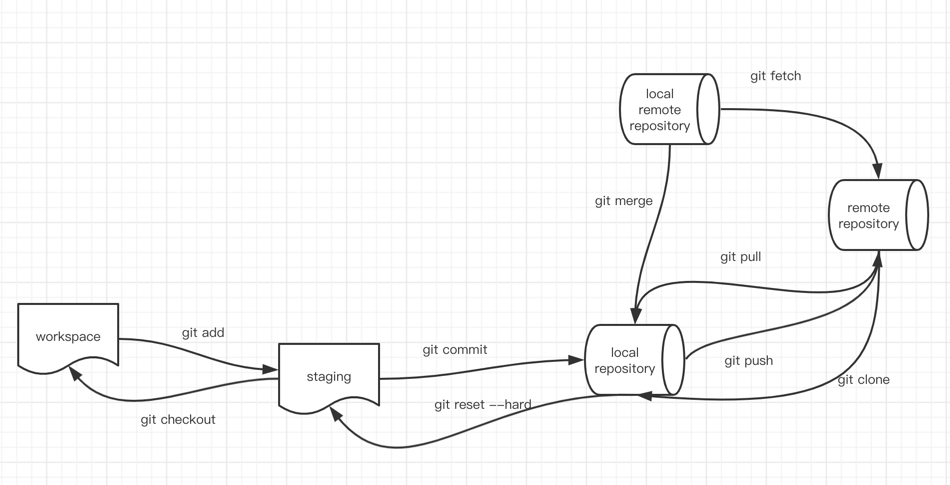

#git reset和git revert的区别是：
reset是用来回滚的，将HEAD的指针指向了想要回滚的版本，作为最新的版本，而后面的版本也都没有了；而revert只是用来撤销某一次更改，对之后的更改并没有影响

# 版本提交
git commit --amend  在一个commitid里面去添加补充。

或者每天commit。  然后reset ，然后再commit。

# git stash

# git 同一个目录下，不允许多个分支

# git worktree

# 假如master刚合并了一个bug分支。
git cherry-pick 4c805e2 可以将master 的内容给合并过来

