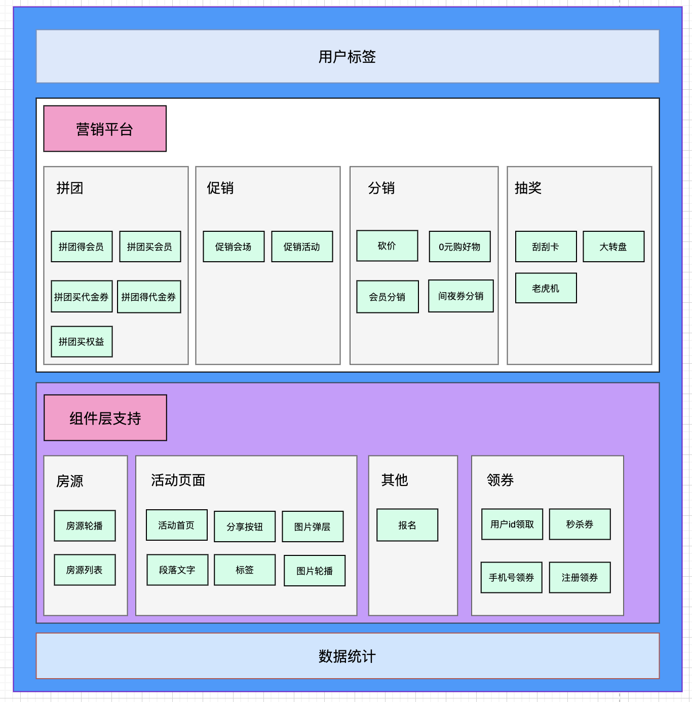

# 自我介绍：

我叫王朝阳，2018年6月从长春理工大学的电子科学与技术专业毕业，学历是硕士。从事PHP有一年半的时间。18年6月校招去的广州棒骨科技有限公司，从事跨境电商的站点开发。然后18年11月来的北京快跑科技有限公司，主要从事投放统计的效果与追踪，做日常促销、节日活动活动，网安数据上报这一块的业务。

# 项目介绍逻辑-v1：

1. 承担什么角色。
2. 合作的伙伴。
3. 遇到什么问题，以及怎么解决，给自己带来哪些提升。解决的过程。不一定能遇到。怎么设计。说一下次序。有哦一个流程，没有过多的技巧。一般都不会出问题。没必要的给去掉。技术栈，比较多，一点，原理性的东西，多一点。不知道也无所谓。模板不要太粗糙。项目不要过多过长，主要做什么，技术栈。职责罗列出来。【职责】   里面涉及到redis  mqsql  mq   具体描述信息。。。中间遇到什么问题，怎么解决的。。自我赶感悟， 经历的感觉， 自己的成长，做几个， 就写几个。主要职责。说一下，自己遇到哪些问题，怎么解决的的，自我评价，评价， 好处。大家是怎么合作的。自己对未来的期望，对上一个总结，对未来的期望。不会看太多。说出自己的技术点。涉及到，技术栈，对应的redis  mq。引到到自己的项目使用中，为什么要用redis，为什么要用mq。而且， 遇到什么问题。整个通篇就很顺畅。很难对一个人，印象，很深刻。写的越多，越没用  那没什么卵用。自我评价，自我感悟，自己的上进心。然后不要写太多。精简点，一定要提炼出技术栈
4. 项目的效果和项目的需求：个人的收货和项目的效果。

# 如何介绍一个项目-v2：
1. 职责
2. 技术
3. 收益/贡献

可以按这个思路，再挖掘些技术点。话术上调整下

# 自己介绍自己的项目：

做项目：一定要有逻辑能力。

1. 面试官让介绍自己的项目，为项目中有什么难点？其实是想问你跟别人的不同点，这是初衷。所有人都差不多，得让面试官看到你的优缺点吧。你能不能主动思考问题。喜不喜欢回顾，喜不喜欢总结？
2. "依据各个广告平台的接口文档，进行公司账号的配置；"。面试官感觉：就是看文档写接口，有啥好说的。改：与第三方广告平台对接，接入投放统计平台。这样写能体现出咱们的沟通协调能力，你不可能只看，文档，你需要和他沟通对吧。
3. 对市场投放同学提供脚本数据支持，以方便其对合作方进行业务结算，以及进行投放计划；
   这条也可以写的更高些，不是脚本，至少只一个完整的工具能输出报表，提供投放效果数据支持
   1、体现我们做事的完整性，有头有尾，不光采集数据，还有分析、展现，工作态度很好。
   2、“提供投放效果数据支持”这句话，说明我们思路很清楚，知道做每件事的目的

# 项目一：
技术栈就不用说了，简历上面已经说了。不是平台，是业务。服务化的拆分。我的架构，一方面是业务需求，把广告投放这一块给独立出来，然后给广告平台去提供业务。

这个项目的问题主要在于存储选型上。大量实时数据写入，没有更新、几乎没有查询（统一分析一次）用MySQL是否合适，什么存储合适，这个你要想明白，而且要说明白现在为什么用MySQL（受公司实际情况限制等等）

#### 架构：
1. 是与第三方的广告平台进行交互的。以callback和主动调取的形式。主要是点击数据的激活和获取。
2. 同时等待客户端数据的上报到我们公司的用户数据。我的数据一方面回传给投放平台，一方面支持市场同学的数据需求。然后也支持大数据平台的建设，进行数据价值的分析。
3. 支持大数据平台的数据建设，将数据的报表以及转化，以数据平台的形式，进行数据展示。
4. ES 是用来进行日志的分析，以及接口请求量的变化，防止异常流量。
5. 匹配成功的话，也记录了日志，能看到下载量和激活量的变化。

#### 功能细节：
1. 提供一个https的接口，给广告平台。用户点击广告的时候，广告平台会以调用callback的形式调用我的接口。然后请求数据存储到redis 里面。
2. 用户下载客户端之后，会上报给用户中心，然后用户以mq的形式，发送消息。
3. 我这边监听消息，然后去redis里面进行数据匹配，然后匹配成功后，回传给广告平台，并存储到数据库。
4. 以报表的形式，每日给市场同学， 发送数据脚本。
5. 支持大数据平台的数据建设，将数据的报表以及转化，以数据平台的形式，进行数据展示。
6. ES 是用来进行日志的分析，以及接口请求量的变化，防止异常流量。
7. 匹配成功的话，也记录了日志，能看到下载量和激活量的变化。
8. 通过算法，给对方生成了唯一的appid和secretId。  然后加密的话，就是给对方生成了  验签的操作。而且，本身是通过sign去进行验证的

#### 难点，
1. 限制大量请求。
2. 检测，异常流量下降

先说，数据怎么流转，别人怎么调用你，你怎么调用别人，然后再说你的qps是多少，这个系统有点糙。重复点击怎么办？点击了多少次，才能完成一次转化，这个事情怎么解决？大数据那边可以看到的啊。数据的挖掘。。。第一次没成功，第二次没成功。可以自己想一想。比如限制对方的请求量，然后匹配逻辑那里，就复杂了。

#### 自己项目的不足
对于熔断，降级，自己这边其实是没有做的。导致自己这边还是有点问题的。没有考虑兜底的方案，也就是自己的服务不可用时，该如何去处理。是否加了服务 注册？发现治理？当日志中出现哪些错误的时候，可以使用钉钉去进行报警。

#### 项目收货：

1. 认识到了日志的作用，通过日志来监测异常流量，能快速定位问题。
2. 分布式系统的稳定性，排查能力。还是bug问题。iOS突然减少，通过监测日志系统报警监控。es日志量iOS激活量抖降。PHP日志，没有异常，也没有慢请求。也没有500问题。然后定位是iOS客户端的问题。感觉了日志在工作中的重要性。日志可以用来统计报表，也能排查问题。提供排查问题思路。是在为整个分布式系统排查问题。通过日志的看板，来监控异常流量。一个是太多，一个是太少。
3. 了解了微服务的概念了吧，了解清楚了职责，谁应该做什么事情。
1. 先说收获，再说怎么排查问题。先看web 卡，还是MySQL卡，还是NGINX卡。性能问题，网络开销问题。熟悉框架，熟悉设计模式。稳定性以及bug的定位；
2. 自己与各个广告渠道方进行沟通，体现了自己良好的交互能力。对于广告方不能支持的部分，自己这边能尽量去做兼容。因为大公司，不会因为业务主的一点点需求，而去进行改动。
3. 自己这边能处理和接收海量上报的数据，包括点击数据，下载，注册，下单等消息，确保数据能够及时正常处理并存储，体现出自己的设计架构能力；
4. 提供数据分析工具，自动分析上报数据。输出报表，提供投放效果数据支持，体现了自己对自己项目的做事态度；
5. 支持大数据部门的BI看板建设， 体现出自己为公司多做的思考。
6. 加入了单元测试。

#### 项目难点
1. 针对于分库分表：我们现在还能抗的住。跟时间强相关，一个月以前的数据价值可能就不太大了。分区可以考虑的。跟业务绑定的方案。业务不是很要命。按主键去拆。按时间去拆会比较合理。mysql分库分表。日志数据，时间归档。partition。
2. 生产者挂了怎么办？（这个东西，不是我做的，随机应变的能力，生产端挂了怎么办。）数据不丢，在日志里面，我通过日志可以找回来的，我是通过我的上游看到流量的异常。自己的报警。   自己有自己的监控。因为我没有做过，不能推给面试官。我们的方案是否ok。去多个维度去想。
3. redis 非强一致性。集群这种方案，挂了这一瞬间的数据，是无法做到数据一致性的。但是我这边其实是允许丢数据的。把你的思维放开。技术方面，不要退缩。我的方案怎么样。这个业务是否合理。分别是哪一类的问题。业务这种。redis本来就不是cp，在业务上，我就是ap。
4. 首先分析并发高，是不是正常，我不应该拦截。接入层的一个高并发的方案。我就应该支持1000w。这个是一个方案。从机器从性能去讲。恶意点击，我是通过用户行为去去重。风控的策略，布隆过滤器。
5. 多个渠道，直接去干掉。我其实是可以干掉一些渠道的。【我这边就真实遇到过】
7. 从监控。兜底，假如出了异常，我能不能恢复。
8. 恶意流量识别。布隆过滤器。
9. 是不是归档到我的数据平台去。归档过程也是一种数据方案。
10. redis 这边一定要强化。
11. 风控这个层面，根据ip去说。
12. 针对数据丢失的情况，我这边就是通过日志去过滤一些信息。比如，我这边就是通过iOS版本号和接口请求，然后去过滤日志，然后处理一下，回传给对方，这对我来说就是补数据的问题。
13. 不要退缩。有逻辑性的阐述问题。但是我怎么去思考。

#### 如果面试官问道系统抗压能力
面试官要是问到压力情况的时候你心里要有数。系统现在能抗多大的压力，预期现在的流量增长水平能支撑多久（半年或1年）；有改进的方案，已经考虑引入新的存储等等。为什么用MySQL，项目时间紧张，只有MySQL，前期先上线，满足功能，再去优化。

这块你要先说下选型的思路，结合自己业务场景，写多读少，想选择写入性能高的存储。正在调研：mongo、pika还在找一些其它的KV存储。后续会写测试用例模拟我们的场景去测试选型

你可以说，这块是自己主动在搞，公司还没有重视起来，自己再挤时间搞，能体现你对技术的追求和责任心。

对于系统的问题：重复数据上报， 对方灌水的情况，自己一直在寻找方案，也做了一定的鉴权，但是目前还没有好的方法呢？可以反问面试官，您有好的建议么?

# 项目二：活动平台的介绍：
活动平台简化配置流程，结合基础活动组件，生成模板类活动。打造丰富可靠的活动模板，提供活动整体的开发效率。

1. 有一张活动表，他用来记录活动的基本信息：活动id，创建人，创建时间，活动名称，修改时间等等，活动状态。
2. 有一张 组件表，记录活动使用了哪些组件，以及组件的一些配置。【活动的一些背景色等信息】
3. 不同的组件，需要使用不同的表进行存储。比如房源组表【记录的是房源属于哪些城市的一个表】还有一个房源表【记录城市下边的房源信息】。领券的话，会有一个组件，券包关联的表，用户领完券，会给用户发相应的券。 

#### 具体表的设计：
以房源上传组件为例：
1. 先创建活动，保存活动的基本信息，比如创建人，创建时间，活动状态。
2. 在这个活动上面，添加房源上传的组件。组件表用来保存包括一些组件的基本信息。比如房源展示数量，排列布局配置等信息。
3. 上传房源，有一个房源组表，用来保存房源城市信息。
4. 还有一个房源表，用来上传城市下面的房源。【房源表和房源组表，是一对多的关系，每个城市下面，可以对应多套房源】

#### 项目收获：
模板化，和组件化，明白了活动组能支持多少功能，业务能力和业务边界。系统的扩展性，系统的稳定性，希望能看到你的一个快速成长的轨迹。设计模式的了解呢？对设计模式有了更深入的了解和实践。对业务拆分和业务边界有了一定的了解。通过公司的链路追踪，然后去进行性能的优化啊。还有就是代码静态检查，提升自己的代码的质量。减少坏代码的数量。展开敏捷开发，提高了开发上线的效率。对基础功能的通用性，有了更多的考虑。

# 项目三-权益售卖系统：
功能：卖给用户，官网上面去进行售卖。运营创建活动，配置活动规则。

1. 前端调用活动平台，活动平台调用支付，生成唯一的paycode码。
2. 前端带着paycode去调用支付。
3. 然后支付组去调用支付宝或者微信。
4. 活动平台，通过mq来监听支付的结果。修改售卖状态，然后在用户权益去进行展示。
5. 并通过接口请求，去通知促销组那边，给用户添加促销资格。

我们也用了xphrof去进行性能的优化。

#### 项目收货：
1. 自己担任项目经历，提升了跨项目组的团队协作能力。
2. 如何保证项目的进度呢？
拆分任务数和时间，给出项目排期推进项目上线。每天在群里公布项目进度。前期的项目拆分一定要细化，思维导图和甘特图。保证项目的推进。
3. 对项目管理和，对于交易系统有了了解。
4. 对数据库的认知：简历索引，数据优化。表啊，字段啊，怎么去优化。
5. 对redis的优化使用，有了了解。
6. 我们也有全链路追踪啊，我也可以看到系统的优化啊，我这边对问题的排查，也是有一定能力的啊？
7. 对日志的排查使用，也是有一定的能力的。
8. 我们也接入了CI/CD,然后对于快速迭代上线有了新的认识。
9. 然后我们也接入了全链路追踪，然后对于问题的排查和性能的优化，有了全新的认识和理解。

# 说一下，你哪个项目做的比较久，收获比较大，效益比较好。
1. 有几个人。后端一个，主要交互的对象，主要是第三方。
2. 是什么形式的平台？就是提供接口，从广告过来的下载和订单。监控异常的流量和bug
3. 协助大数据的建设。看板如何用数据，我这边的话，是通过elk然后来监测，
4. 用到了几张数据表。
5. 消息队列，
6. NGINX    redis   rabbitmq   都是别人协助的，申请线上云机器的都是装好的。
7. 开发机，所有的环境，都是大家共用的。我自己本地的环境，
8.  fastcgi  和fpm的是什么？
9.  遇到哪些难点？
10.  抖降和陡增，是怎么解决的？  其实陡增的解决办法不太好？不能完全信赖对方？如何出解决方案，自己也应该有一个兜底。其实承受不了，太多的流量，在消息队列去做一个限流。其实应该你能承受多少，然后就去做限流。如何监控日志的异常。会登录日志的实时的分析。去看来自于那个接口，来自于哪个ip。
11.  这个ip在这个小时内，请求了多少次。
https://codante.org/blog/post/service-log-common-commands/
9. 

